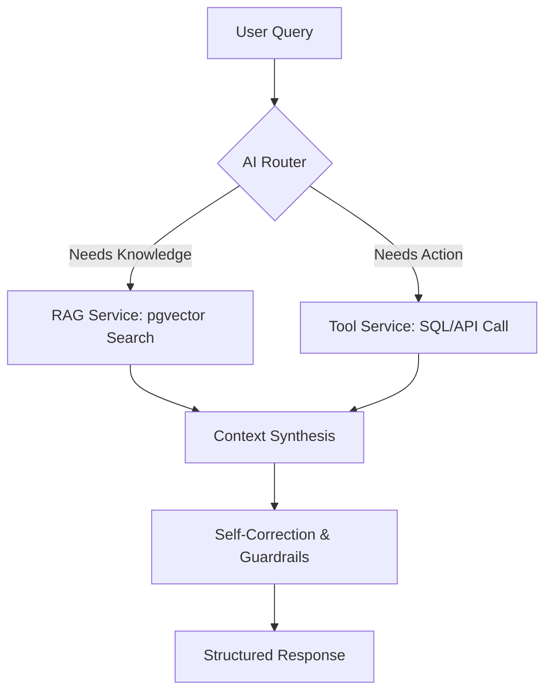

## AI Knowledge & Operations Agent (Agentic RAG)

**A production-ready intelligence layer for modern business automation.**

This project defines an **Agentic RAG system** that can:

- **Understand** your internal documents (PDFs, docs, chat logs, knowledge base).
- **Act** on your behalf via tools (inventory APIs, ticketing, CRM, calendar, etc.).
- **Correct itself** to reduce hallucinations and unsafe outputs.

The goal is to later implement this design using **NestJS**, so this README focuses on a clear, future-proof architecture and setup.

---

## Vision

Modern companies are drowning in unstructured data. Traditional search is keyword-based and often fails to capture **meaning**, intent, and context.

This system is not just a chatbot; it is an **Agentic AI Orchestrator** that:

- **Reasons over private documentation** using RAG.
- **Calls internal tools and services** (SQL, HTTP APIs, 3rd-party SaaS).
- **Uses guardrails and self-correction** to improve reliability.

---

## Core Architecture

At a high level the system is an **Agentic RAG backend** built on NestJS:

- **Chat RAG layer** (`ChatModule`, `ChatService`):
  - Ingests PDFs or raw text.
  - Splits them into chunks.
  - Embeds chunks with a local Ollama embedding model.
  - Stores them in an in-memory vector store.
  - Answers questions using Retrieval-Augmented Generation (RAG).
- **Agent layer** (`AgentModule`, `AgentService`):
  - Exposes a higher-level `/agent/chat` API that can orchestrate tools and RAG.
- **Business tools layer**:
  - `InventoryModule`, `SupportModule`, `CalendarModule`, `ToolsModule` wrap concrete business actions as services.

### Current Implementation (MVP in this repo)

The code in this repository implements an initial **MVP RAG chatbot** with:

- **NestJS** as the HTTP/API framework.
- **LangChain.js** for:
  - `MemoryVectorStore` (in-memory semantic search).
  - `RecursiveCharacterTextSplitter` for chunking.
  - `createStuffDocumentsChain` for RAG.
- **Ollama** for *both*:
  - **Embeddings**: `mxbai-embed-large` (configurable via `EMBEDDINGS_OLLAMA_MODEL`).
  - **Chat LLM**: `llama3.2:3b` (configurable via `CHAT_OLLAMA_MODEL`).

Key NestJS pieces:

- `ChatService`:
  - `init()`:
    - Creates an Ollama chat model (`ChatOllama`) and Ollama embeddings.
    - Creates an in-memory `MemoryVectorStore`.
  - `ingest()`:
    - Accepts raw text docs and/or PDF paths.
    - Uses a PDF loader and text splitter.
    - Adds resulting chunks to the `MemoryVectorStore`.
  - `handleFileUpload()`:
    - Receives uploaded PDFs.
    - Saves them under `./uploads`.
    - Passes their paths into `ingest()`.
  - `query()`:
    - Turns the vector store into a retriever.
    - Retrieves top‑K similar chunks for a question.
    - Runs a RAG chain (`createStuffDocumentsChain`) with a context‑aware prompt.
    - Returns: answer, sources (PDF paths), and `contextCount`.
- `ChatController`:
  - `POST /chat/ingest`: ingest text or known PDF paths.
  - `POST /chat/upload`: upload PDFs and ingest them.
  - `POST /chat/ask`: ask a question against the indexed content.

This gives you a **working RAG chatbot** against your PDFs using only:

- Local Ollama models (no external LLM API required).
- An in-memory vector store (fast feedback for development).

### Business Workflow (Today)

From a business / user point of view the current flow is:

1. **Knowledge ingestion**
   - Ops / admin uploads PDFs (e.g. product docs, internal CVs, SOPs) via `POST /chat/upload`.
   - The system:
     - Extracts text from each PDF.
     - Splits it into overlapping chunks.
     - Embeds each chunk with Ollama.
     - Stores the embeddings and metadata in memory.

2. **Question answering**
   - A client or internal user sends a question to `POST /chat/ask`, for example:
     - “Who is Rifat?”
     - “What is our refund policy?”
   - The backend:
     - Embeds the question.
     - Retrieves the most similar chunks from the in‑memory store.
     - Runs the RAG chain with a prompt that says:
       - “Use only this context to answer.”
       - “If nothing relevant is found, say you don’t know based on the context.”
   - The response includes:
     - A concise natural‑language answer.
     - A list of **source files** (PDF paths) used to answer.
     - `contextCount` – how many chunks were considered.

3. **Business integration via tools (early stage)**
   - Separate NestJS modules (`inventory`, `support`, `calendar`, `tools`) encapsulate real business operations in services.
   - The **Agent layer** can be extended to:
     - Decide when to call RAG vs. a tool.
     - Combine knowledge answers with live data (e.g. inventory, ticket creation, calendar booking).

---

## Tech Stack (Current MVP)

- **Backend Framework**: NestJS.
- **AI Orchestration**: `langchain`, `@langchain/core`.
- **LLM & Embeddings**: Ollama (`ChatOllama`, `OllamaEmbeddings`).
- **Vector Store**: `MemoryVectorStore` (in-memory; per-process).
- **PDF Parsing**: `pdf-parse` + LangChain PDF loader.
- **Configuration**: `@nestjs/config` with `.env`.

> **Note:** The README still describes a more advanced, **future** architecture (pgvector, ReAct-style agent, etc.) which will be implemented in later phases.

---

## High-Level Data Flow (Conceptual Future Design)

Conceptual flow of a user query through the full Agentic RAG system:



- **AI Router**: Decides whether to use RAG, tools, or both.
- **RAG Service**: Retrieves relevant context from the vector store.
- **Tool Service**: Executes business actions (inventory, tickets, CRM).
- **Self-Correction & Guardrails**: Validates and adjusts responses.
- **Structured Response**: Returns a safe, useful answer to the caller.

---

## Business Value

- **Reduce Support Costs**: Deflect a large portion of repetitive tickets by answering from documentation and tools.
- **24/7 Sales Support**: Recommend products based on **user intent**, not just keywords.
- **Faster Onboarding**: New employees can query handbooks, SOPs, and policies in natural language.

---

## Models Used (Current vs Future)

### Today (this repo)

The current implementation uses **Ollama only**:

- **Embeddings**: `mxbai-embed-large` (or another local embedding model).
- **Chat LLM**: `llama3.2:3b` (or another local chat model).

Everything runs **locally** as long as Ollama is running and the models are pulled.

### Future Option: Hybrid OpenRouter + Ollama

In a later phase you can switch to a **hybrid setup**:

- Keep **Ollama** for embeddings (local, private, free).
- Use **OpenRouter** (DeepSeek / OpenAI / Anthropic) for the chat LLM if you want:
  - larger models,
  - better reasoning,
  - or hosted infrastructure.

---

## Getting Started (Current MVP)

### 1. Prerequisites

- **Node.js** `v18+`
- **Ollama** installed and running.
  - `ollama list` should show at least:
    - `mxbai-embed-large:latest`
    - `llama3.2:3b`

### 2. Installation

```bash
pnpm install        # or npm install / yarn
cp .env.example .env
pnpm run start:dev  # or npm run start:dev
```

### 3. Key Environment Variables

- `PORT` – API port (default `3000`).
- `OLLAMA_BASE_URL` – e.g. `http://localhost:11434`.
- `CHAT_OLLAMA_MODEL` – e.g. `llama3.2:3b`.
- `EMBEDDINGS_OLLAMA_MODEL` – e.g. `mxbai-embed-large`.

---

## API Usage (Concept)

Example of how a client might interact with the agent once the NestJS APIs exist:

```http
POST /agent/chat
Content-Type: application/json

{
  "message": "I need a warm jacket for a ski trip, what's in stock?"
}
```

Expected behavior:

- The agent searches the vector DB for relevant product and domain knowledge (e.g. "warm jacket", "ski", "weather", etc.).
- It calls the **`check_inventory`** tool to verify real-time stock and sizes.
- It returns a **structured, natural-language response** with product recommendations and availability.

---

## Roadmap & Future Phases

### Phase 1 – RAG Chatbot with NestJS + LangChain + Ollama (this repo)

For the **first MVP and test/experimental phase**, this NestJS project implements:

1. **Environment Setup & Dependencies**
   - Install core dependencies:
     - `langchain`, `@langchain/core`, `@langchain/community`
     - `@langchain/ollama` (for local embeddings)
     - `@langchain/openai` (for LLM integration via OpenRouter)
     - `pdf-parse` (to read PDF files).

2. **Local Infrastructure Setup**
   - Install **Ollama**: download and install Ollama for local model hosting.
   - Pull embedding model: `ollama pull mxbai-embed-large`.
   - Configure **OpenRouter**: generate an API key from OpenRouter to access LLMs like **DeepSeek R1** without high local hardware requirements.

3. **Core Module Development**
   - Ensure `ChatModule`, `ChatController`, and `ChatService` exist (generate them if needed).
   - Configuration: set up `ConfigModule` to securely handle API keys and local URLs.
   - Initialization: use `onModuleInit` to pre-configure:
     - the LLM,
     - embeddings,
     - and the vector store (`MemoryVectorStore`),
     so they are ready at startup.

4. **Data Ingestion Pipeline**
   - Raw text ingestion: create a DTO and service method to accept raw JSON text and convert it into LangChain `Document` objects.
   - PDF processing: implement a `PDFLoader`-style helper to extract text and page numbers from files.
   - Text splitting: use `RecursiveCharacterTextSplitter` with chunk size `1000` and overlap `150` to maintain context.
   - Vector storage: add the split chunks into a `MemoryVectorStore` using local Ollama embeddings.

5. **Dynamic File Uploads**
   - Multer integration: use NestJS `FilesInterceptor` to handle multipart form-data uploads.
   - Storage configuration: save files to a local `./uploads` directory with unique timestamps.
   - File filtering: implement logic to strictly allow only PDF files for ingestion.

6. **Retrieval-Augmented Generation (RAG) Querying**
   - Retriever setup: configure the vector store to retrieve the top **4** most relevant document chunks for any user question.
   - System prompting: design a "context-aware" prompt that instructs the LLM to only answer based on provided data to prevent hallucinations.
   - RAG chain: combine the retriever, prompt template, and LLM using `createStuffDocumentsChain` (or equivalent).
   - Source attribution: map the metadata of retrieved chunks to return a list of sources (e.g., filenames) with every answer.

7. **Testing & API Endpoints**
   - `POST /chat/ingest`: manual text and local file paths.
   - `POST /chat/upload`: dynamic PDF uploads.
   - `POST /chat/ask`: query the chatbot and get answer + sources.

### Phase 2 – Persistent Vector DB (pgvector)

Next step is to replace the in-memory vector store with a **persistent vector database**:

- **PostgreSQL + `pgvector`**:
  - Store embeddings and document metadata in tables.
  - Survive restarts and scale beyond single-process memory.
- Changes in code:
  - Swap `MemoryVectorStore` for a `PGVectorStore`/custom TypeScript repository.
  - Add migrations / Prisma schema for embedding tables.
  - Re-use the same ingestion + splitting pipeline; only the storage backend changes.

Business impact:

- Index once, reuse across deployments.
- Support larger knowledge bases and multi-instance deployments.

### Phase 3 – Agentic Workflows + DB-Driven Inputs

Later, the agent will:

- Pull **live data from the DB** (PostgreSQL) as part of tools:
  - Inventory queries, order history, user profiles, SLAs, etc.
- Combine:
  - **Static knowledge** (RAG over documents).
  - **Dynamic data** (SQL/ORM queries).
- Use ReAct-style loops to:
  - Plan > call tools (DB, HTTP APIs) > reason > respond.

This will turn the system from “chat over documents” into a full **AI operations layer** that:

- Answers questions grounded in docs.
- Executes real business operations using your database and services.