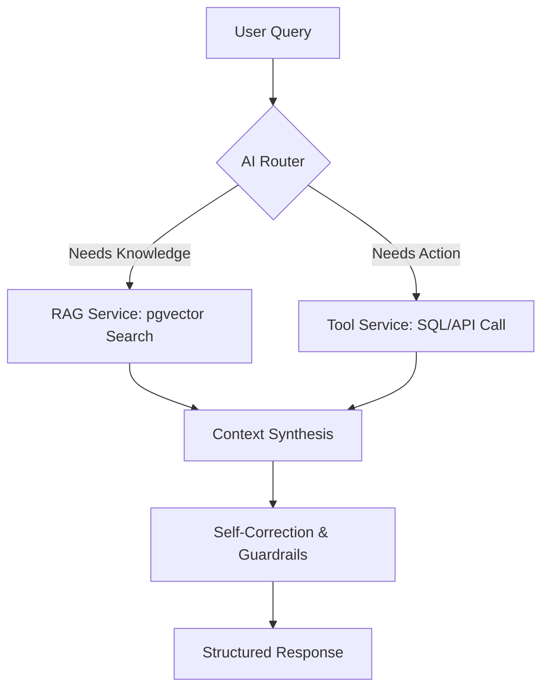

## AI Knowledge & Operations Agent (Agentic RAG)

**A production-ready intelligence layer for modern business automation.**

This project defines an **Agentic RAG system** that can:

- **Understand** your internal documents (PDFs, docs, chat logs, knowledge base).
- **Act** on your behalf via tools (inventory APIs, ticketing, CRM, calendar, etc.).
- **Correct itself** to reduce hallucinations and unsafe outputs.

The goal is to later implement this design using **NestJS**, so this README focuses on a clear, future-proof architecture and setup.

---

## Vision

Modern companies are drowning in unstructured data. Traditional search is keyword-based and often fails to capture **meaning**, intent, and context.

This system is not just a chatbot; it is an **Agentic AI Orchestrator** that:

- **Reasons over private documentation** using RAG.
- **Calls internal tools and services** (SQL, HTTP APIs, 3rd-party SaaS).
- **Uses guardrails and self-correction** to improve reliability.

---

## Core Architecture

The system follows the **Reason–Act (ReAct)** pattern:

- The LLM does not just answer directly.
- It **plans**, **decides which tools to call**, **executes actions**, then **produces a final, structured response**.

### 1. Advanced RAG Pipeline

- **Vector Engine**: PostgreSQL with `pgvector` for semantic search.
- **Smart Chunking**: ~1000-token recursive splitting with overlap for coherent context.
- **Hybrid Search**:
  - Vector similarity for semantic matching.
  - SQL metadata filters for precision (e.g. document type, owner, tags, timestamps).

### 2. Agentic Tool System

The agent can call tools to interact with your business data and operations, for example:

- **`check_inventory()`**: Fetch live stock levels from SQL or internal APIs.
- **`create_support_ticket()`**: Open a Jira or database ticket from a user issue.
- **`book_product_demo()`**: Schedule product demos in a calendar system.

In NestJS, each of these tools will typically map to:

- A **service class** (e.g. `InventoryService`, `TicketsService`).
- An **agent tools layer** that exposes safe wrappers to the LLM.

---

## Tech Stack (Planned)

- **Backend Framework**: NestJS (Node.js enterprise framework).
- **AI Orchestration**: `LangChain.js` and `LangGraph`.
- **LLM Provider**: OpenRouter (DeepSeek-R1; free-tier friendly).
- **Database**: PostgreSQL with `pgvector` extension.
- **ORM**: Prisma or TypeORM (to be finalized).
- **API Documentation**: Swagger / OpenAPI.

---

## High-Level Data Flow

Conceptual flow of a user query through the system:



- **AI Router**: Decides whether to use RAG, tools, or both.
- **RAG Service**: Retrieves relevant context from the vector store.
- **Tool Service**: Executes business actions (inventory, tickets, CRM).
- **Self-Correction & Guardrails**: Validates and adjusts responses.
- **Structured Response**: Returns a safe, useful answer to the caller.

---

## Business Value

- **Reduce Support Costs**: Deflect a large portion of repetitive tickets by answering from documentation and tools.
- **24/7 Sales Support**: Recommend products based on **user intent**, not just keywords.
- **Faster Onboarding**: New employees can query handbooks, SOPs, and policies in natural language.

---

## Why use two models (OpenRouter + Ollama)?

This project is designed to work well with a **hybrid RAG setup** that combines:

- **Ollama (local) for embeddings**: run a local embedding model such as `mxbai-embed-large` to convert your PDF or knowledge-base text into vectors. This keeps the **indexing/search side**:
  - free to run,
  - private (data stays on your machine),
  - not dependent on a fast internet connection.

- **OpenRouter (cloud) for the LLM**: use a hosted chat model such as **DeepSeek-R1 (free tier via OpenRouter)** as the "brain" of the agent. Large LLMs need significant RAM/GPU; delegating them to OpenRouter keeps your app lightweight while still giving you strong reasoning and generation quality.

You still need an **OpenRouter API key** because:

- It provides **unified access** to many models (OpenAI, Anthropic, DeepSeek, etc.).
- It lets you use **free models like DeepSeek-R1** without adding a credit card with each vendor.
- It allows OpenRouter to **authenticate, rate limit, and secure** requests, even for free usage.

In short:

- **Local (Ollama)** handles the heavy lifting of **reading and storing** your PDFs (embeddings).
- **Cloud (OpenRouter + DeepSeek-R1)** handles the **answering and reasoning** over those embeddings.

Together, you get a system that can process large documents locally for free, while using a high-quality cloud model to chat with that data.

---

## Getting Started (Planned Setup)

> The exact commands may change as the NestJS project is implemented, but this is the intended baseline flow.

### 1. Prerequisites

- **Node.js** `v18+`
- **PostgreSQL** with the **`pgvector`** extension enabled
- **OpenRouter API key** (for DeepSeek-R1, e.g. `deepseek-r1:free`)

### 2. Installation

Once the NestJS project is created, a typical setup will look like:

```bash
npm install
cp .env.example .env
npx prisma migrate dev   # or TypeORM migrations
npm run start:dev
```

### 3. Environment Variables (Example)

The actual variables will be defined when the NestJS app is scaffolded, but will likely include:

- `DATABASE_URL`
- `OPENROUTER_API_KEY` – your OpenRouter key.
- `OPENROUTER_MODEL` – e.g. `deepseek-r1:free`.
- `OPENROUTER_BASE_URL` – usually `https://openrouter.ai/api/v1`.
- `VECTOR_COLLECTION_NAME`
- `PORT`

---

## API Usage (Concept)

Example of how a client might interact with the agent once the NestJS APIs exist:

```http
POST /agent/chat
Content-Type: application/json

{
  "message": "I need a warm jacket for a ski trip, what's in stock?"
}
```

Expected behavior:

- The agent searches the vector DB for relevant product and domain knowledge (e.g. "warm jacket", "ski", "weather", etc.).
- It calls the **`check_inventory`** tool to verify real-time stock and sizes.
- It returns a **structured, natural-language response** with product recommendations and availability.

---

## Roadmap: Building a RAG Chatbot with NestJS, LangChain, and Ollama (MVP)

For the **first MVP and test/experimental phase**, this existing NestJS project will be extended as follows:

1. **Environment Setup & Dependencies**
   - Install core dependencies:
     - `langchain`, `@langchain/core`, `@langchain/community`
     - `@langchain/ollama` (for local embeddings)
     - `@langchain/openai` (for LLM integration via OpenRouter)
     - `pdf-parse` (to read PDF files).

2. **Local Infrastructure Setup**
   - Install **Ollama**: download and install Ollama for local model hosting.
   - Pull embedding model: `ollama pull mxbai-embed-large`.
   - Configure **OpenRouter**: generate an API key from OpenRouter to access LLMs like **DeepSeek R1** without high local hardware requirements.

3. **Core Module Development**
   - Ensure `ChatModule`, `ChatController`, and `ChatService` exist (generate them if needed).
   - Configuration: set up `ConfigModule` to securely handle API keys and local URLs.
   - Initialization: use `onModuleInit` to pre-configure:
     - the LLM,
     - embeddings,
     - and the vector store (`MemoryVectorStore`),
     so they are ready at startup.

4. **Data Ingestion Pipeline**
   - Raw text ingestion: create a DTO and service method to accept raw JSON text and convert it into LangChain `Document` objects.
   - PDF processing: implement a `PDFLoader`-style helper to extract text and page numbers from files.
   - Text splitting: use `RecursiveCharacterTextSplitter` with chunk size `1000` and overlap `150` to maintain context.
   - Vector storage: add the split chunks into a `MemoryVectorStore` using local Ollama embeddings.

5. **Dynamic File Uploads**
   - Multer integration: use NestJS `FilesInterceptor` to handle multipart form-data uploads.
   - Storage configuration: save files to a local `./uploads` directory with unique timestamps.
   - File filtering: implement logic to strictly allow only PDF files for ingestion.

6. **Retrieval-Augmented Generation (RAG) Querying**
   - Retriever setup: configure the vector store to retrieve the top **4** most relevant document chunks for any user question.
   - System prompting: design a "context-aware" prompt that instructs the LLM to only answer based on provided data to prevent hallucinations.
   - RAG chain: combine the retriever, prompt template, and LLM using `createStuffDocumentsChain` (or equivalent).
   - Source attribution: map the metadata of retrieved chunks to return a list of sources (e.g., filenames) with every answer.

7. **Testing & API Endpoints**
   - `POST /chat/ingest`: for manual text and local file paths.
   - `POST /chat/upload`: for dynamic PDF uploads.
   - `POST /chat/ask`: to query the chatbot with a question and get an answer plus sources.

This is the **explicit MVP roadmap** we will implement first; later phases can evolve it into the larger Agentic RAG architecture described above.