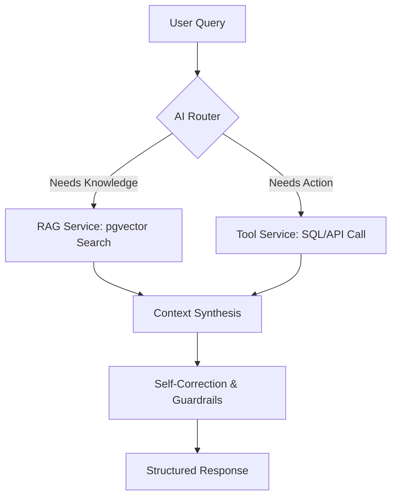

## AI Knowledge & Operations Agent (Agentic RAG)

**A production-ready intelligence layer for modern business automation.**

This project defines an **Agentic RAG system** that can:

- **Understand** your internal documents (PDFs, docs, chat logs, knowledge base).
- **Act** on your behalf via tools (inventory APIs, ticketing, CRM, calendar, etc.).
- **Correct itself** to reduce hallucinations and unsafe outputs.

The goal is to later implement this design using **NestJS**, so this README focuses on a clear, future-proof architecture and setup.

---

## Vision

Modern companies are drowning in unstructured data. Traditional search is keyword-based and often fails to capture **meaning**, intent, and context.

This system is not just a chatbot; it is an **Agentic AI Orchestrator** that:

- **Reasons over private documentation** using RAG.
- **Calls internal tools and services** (SQL, HTTP APIs, 3rd-party SaaS).
- **Uses guardrails and self-correction** to improve reliability.

---

## Core Architecture

At a high level the system is an **Agentic RAG backend** built on NestJS:

- **Chat RAG layer** (`ChatModule`, `ChatService`):
  - Ingests PDFs or raw text (currently tuned for **invoice + shipping-policy** documents).
  - Splits them into chunks.
  - Embeds chunks with a local Ollama embedding model.
  - Stores them in Qdrant (Docker vector DB) when configured, with an in-memory vector store as a fallback.
  - Answers questions using Retrieval-Augmented Generation (RAG).
- **Agent layer** (`AgentModule`, `AgentService`):
  - Exposes a higher-level `/agent/chat` API that can orchestrate tools and RAG.
<!-- Business tools layer (inventory/support/calendar/tools) was part of the original design but has been removed from the current MVP to keep the focus on invoice + shipping RAG. -->

### Current Implementation (MVP in this repo)

The code in this repository implements an initial **MVP RAG chatbot focused on invoices & parcel shipping support** with:

- **NestJS** as the HTTP/API framework.
- **LangChain.js** for:
  - `QdrantVectorStore` (persistent vector DB via Qdrant when `QDRANT_URL` is set).
  - `MemoryVectorStore` as a fallback when Qdrant is not available.
  - `RecursiveCharacterTextSplitter` for chunking.
  - `createStuffDocumentsChain` for RAG.
- **Ollama** for *both*:
  - **Embeddings**: `mxbai-embed-large` (configurable via `EMBEDDINGS_OLLAMA_MODEL`).
  - **Chat LLM**: `llama3.2:3b` (configurable via `CHAT_OLLAMA_MODEL`).

Key NestJS pieces:

- `ChatService`:
  - `init()`:
    - Creates an Ollama chat model (`ChatOllama`) and Ollama embeddings.
    - Connects to **Qdrant** (using `QDRANT_URL`) for a persistent vector store when available; otherwise falls back to an in-memory `MemoryVectorStore`.
  - `ingest()`:
    - Accepts raw text docs and/or PDF paths (for this MVP, oriented around **invoice and shipping-policy content**).
    - Uses a PDF loader and text splitter.
    - Adds resulting chunks to the active vector store (Qdrant or in-memory).
  - `handleFileUpload()`:
    - Receives uploaded PDFs.
    - Saves them under `./uploads`.
    - Passes their paths into `ingest()`.
  - `query()`:
    - Turns the vector store into a retriever.
    - Retrieves top‑K similar chunks for a question.
    - Runs a RAG chain (`createStuffDocumentsChain`) with a context‑aware prompt.
    - Returns: answer, sources (PDF paths), and `contextCount`.
- `ChatController`:
  - `POST /chat/ingest`: ingest text or known PDF paths.
  - `POST /chat/upload`: upload PDFs and ingest them.
  - `POST /chat/ask`: ask a question against the indexed content.

This gives you a **working RAG chatbot** against your invoice / shipping PDFs and JSON docs using only:

- Local Ollama models (no external LLM API required).
- Qdrant as a persistent vector DB (via Docker), with an in-memory vector store as a fallback for development.

### Business Workflow (Today)

From a business / user point of view the current flow is:

1. **Knowledge ingestion**
   - Ops / admin uploads PDFs (e.g. product docs, internal CVs, SOPs) via `POST /chat/upload`.
   - The system:
     - Extracts text from each PDF.
     - Splits it into overlapping chunks.
     - Embeds each chunk with Ollama.
     - Stores the embeddings and metadata in memory.

2. **Question answering**
   - A client or internal user sends a question to `POST /chat/ask`, for example:
     - “Who is Rifat?”
     - “What is our refund policy?”
   - The backend:
     - Embeds the question.
     - Retrieves the most similar chunks from the in‑memory store.
     - Runs the RAG chain with a prompt that says:
       - “Use only this context to answer.”
       - “If nothing relevant is found, say you don’t know based on the context.”
   - The response includes:
     - A concise natural‑language answer.
     - A list of **source files** (PDF paths) used to answer.
     - `contextCount` – how many chunks were considered.

3. **Business integration via tools (early stage)**
   - Separate NestJS modules (`inventory`, `support`, `calendar`, `tools`) encapsulate real business operations in services.
   - The **Agent layer** can be extended to:
     - Decide when to call RAG vs. a tool.
     - Combine knowledge answers with live data (e.g. inventory, ticket creation, calendar booking).

---

## Tech Stack (Current MVP)

- **Backend Framework**: NestJS.
- **AI Orchestration**: `langchain`, `@langchain/core`.
- **LLM & Embeddings**: Ollama (`ChatOllama`, `OllamaEmbeddings`).
- **Vector Store**:
  - Qdrant via `@langchain/qdrant` (persistent; runs in Docker and survives API restarts).
  - `MemoryVectorStore` as an automatic fallback when Qdrant is not reachable or `QDRANT_URL` is unset.
- **PDF Parsing**: `pdf-parse` + LangChain PDF loader.
- **Configuration**: `@nestjs/config` with `.env`.

> **Note:** The README still describes a more advanced, **future** architecture (pgvector, ReAct-style agent, etc.) which will be implemented in later phases.

---

## High-Level Data Flow (Conceptual Future Design)

Conceptual flow of a user query through the full Agentic RAG system:



- **AI Router**: Decides whether to use RAG, tools, or both.
- **RAG Service**: Retrieves relevant context from the vector store.
- **Tool Service**: Executes business actions (inventory, tickets, CRM).
- **Self-Correction & Guardrails**: Validates and adjusts responses.
- **Structured Response**: Returns a safe, useful answer to the caller.

---

## Business Value

- **Reduce Support Costs**: Deflect a large portion of repetitive tickets by answering from documentation and tools.
- **24/7 Sales Support**: Recommend products based on **user intent**, not just keywords.
- **Faster Onboarding**: New employees can query handbooks, SOPs, and policies in natural language.

---

## Models Used (Current vs Future)

### Today (this repo)

The current implementation uses **Ollama only**:

- **Embeddings**: `mxbai-embed-large` (or another local embedding model).
- **Chat LLM**: `llama3.2:3b` (or another local chat model).

Everything runs **locally** as long as Ollama is running and the models are pulled.

### Future Option: Hybrid OpenRouter + Ollama

In a later phase you can switch to a **hybrid setup**:

- Keep **Ollama** for embeddings (local, private, free).
- Use **OpenRouter** (DeepSeek / OpenAI / Anthropic) for the chat LLM if you want:
  - larger models,
  - better reasoning,
  - or hosted infrastructure.

---

## Getting Started (Current MVP)

You can run the app **locally** (Node + Ollama on the host) or **with Docker** (Ollama, Postgres, and API in containers). For Docker, see **[Running with Docker](#running-with-docker)** below.

### 1. Prerequisites (local run)

- **Node.js** `v18+`
- **Ollama** installed and running.
  - `ollama list` should show at least:
    - `mxbai-embed-large:latest`
    - `llama3.2:3b`

### 2. Installation

```bash
pnpm install        # or npm install / yarn
cp .env.example .env
pnpm run start:dev  # or npm run start:dev
```

### 3. Key Environment Variables

- `PORT` – API port (default `3000`).
- `OLLAMA_BASE_URL` – e.g. `http://localhost:11434`.
- `CHAT_OLLAMA_MODEL` – e.g. `llama3.2:3b`.
- `EMBEDDINGS_OLLAMA_MODEL` – e.g. `mxbai-embed-large`.

---

## Running with Docker

You can run the full stack (Ollama, Postgres, and the NestJS API) with **Docker** and **Docker Compose**. This avoids installing Node, Ollama, or PostgreSQL on your machine and keeps versions consistent across environments.

### Why use Docker / Docker Compose?

- **Single command** – Start Ollama, Postgres, and the RAG API together.
- **Reproducible** – Same Node, pnpm, and OS layer in the API container; same Ollama and pgvector images everywhere.
- **Isolated** – No need to install Ollama or Postgres locally; useful for CI or a clean dev machine.
- **Model pull in Compose** – The `ollama-pull` service can pull the chat and embedding models into the Ollama container so they’re ready for the API.

### What’s in the Compose file

| Service       | Purpose |
|---------------|---------|
| **ollama**    | Runs the Ollama server (HTTP on `11434`). Stores models in a volume so they persist. |
| **ollama-pull** | One-off job: pulls models listed in `OLLAMA_PULL_MODELS` (default: `llama3.2:3b`, `mxbai-embed-large`) into the Ollama service. Run once after `ollama` is up. |
| **qdrant**    | Qdrant vector database. **This is the active vector DB** used by `ChatService` for invoice / policy search when `QDRANT_URL` is set. Data is stored in the `qdrant_data` Docker volume so it survives API restarts. |
| **postgres**  | PostgreSQL with pgvector **reserved for future phases**. Present in compose, but not required by the current invoice RAG flow. |
| **api**       | NestJS RAG API (builds from the repo `Dockerfile`). Connects to `ollama` and `qdrant` (and `postgres` in later phases) by service name when running inside Docker. |

### Prerequisites

- **Docker** and **Docker Compose** (v2).
- On macOS with **Colima**: ensure the Docker daemon is running (`colima start`). For `llama3.2:3b`, give the VM at least 4 GB RAM:  
  `colima stop && colima start --memory 4`

### How to run

1. **Start Ollama, Qdrant, Postgres, and the API (all in Docker):**

   ```bash
   docker compose up -d
   ```

2. **Pull Ollama models** (first time, or when you add a new model to `OLLAMA_PULL_MODELS`):

   ```bash
   docker compose run --rm ollama-pull
   ```

   This uses `OLLAMA_HOST=http://ollama:11434` so models are stored in the `ollama` container. To confirm:

   ```bash
   docker exec ollama ollama list
   ```

3. **Use the API** at `http://localhost:3000`:
   - **Chat (ask):** `POST http://localhost:3000/chat/ask` — send a question, get answer + sources.
   - Ingest: `POST http://localhost:3000/chat/upload` (PDFs), `POST http://localhost:3000/chat/ingest` (text/PDF paths).

In this full-Docker mode:

- `api` talks to **Ollama** at `http://ollama:11434`.
- `api` talks to **Qdrant** at `http://qdrant:6333` (via `QDRANT_URL` in `docker-compose.yml`).

### Environment variables for Docker

Create a `.env` in the project root (see `.env.example`). Compose passes these into the **api** and **ollama-pull** services:

- **API:**  
  `PORT`, `DATABASE_URL`, `OLLAMA_BASE_URL`, `CHAT_OLLAMA_MODEL`, `EMBEDDINGS_OLLAMA_MODEL`, `RAG_RETRIEVAL_K`, optional `OPENROUTER_API_KEY`, `GEMINI_API_KEY`.
- **ollama-pull:**  
  `OLLAMA_PULL_MODELS` – space-separated list (e.g. `llama3.2:3b mxbai-embed-large`). Add or change models here and run `docker compose run --rm ollama-pull` again.

Override the chat or embedding model for the API in `.env`:

```env
CHAT_OLLAMA_MODEL=llama3.2:3b
EMBEDDINGS_OLLAMA_MODEL=mxbai-embed-large
OLLAMA_PULL_MODELS=llama3.2:3b mxbai-embed-large
```

### Dev vs production: two ways to run

You can either run **everything in Docker** (prod-style), or run **only Ollama + Qdrant in Docker** and the API with pnpm on your machine.

- **Option A – Full Docker (prod style)**  
  API, Ollama, Qdrant, Postgres all run in Docker.

  ```bash
  docker compose up -d                # starts ollama, qdrant, postgres, api
  docker compose run --rm ollama-pull # pull models into the ollama container
  ```

  In this mode:

  - API → Ollama at `http://ollama:11434`
  - API → Qdrant at `http://qdrant:6333`

- **Option B – Dev: API local, Ollama + Qdrant in Docker**  
  Docker runs only the ML/vector infra; Nest API runs locally via pnpm.

  Start infra in Docker:

  ```bash
  docker compose up -d ollama qdrant
  docker compose run --rm ollama-pull
  ```

  Run API locally:

  ```bash
  pnpm run start:dev
  ```

  In your host `.env`:

  ```env
  OLLAMA_BASE_URL=http://localhost:11434   # forwards to Docker ollama
  QDRANT_URL=http://localhost:6333         # forwards to Docker qdrant
  ```

### Low memory (e.g. “model requires more system memory”)

If the Ollama container has less than ~2.3 GiB free, `llama3.2:3b` may fail to load. You can:

- **Give Ollama more RAM** – e.g. Colima: `colima stop && colima start --memory 4`, then `docker compose up -d`.
- **Use a smaller chat model** – In `.env` set  
  `CHAT_OLLAMA_MODEL=tinyllama` and  
  `OLLAMA_PULL_MODELS=tinyllama mxbai-embed-large`, then run `docker compose run --rm ollama-pull` and restart the stack.

### Rebuild the API image

After changing the app or the Dockerfile:

```bash
docker compose build api
docker compose up -d
```

Or in one step:

```bash
docker compose up --build -d
```

### Application logs (free, no API key)

RAG and vector-store events are written as **JSON lines to stdout** (no third-party services or API keys).

**How to see live log updates**

1. Start the stack: `docker compose up -d`
2. In **another terminal**, follow the API logs:  
   `docker compose logs -f api`
3. Trigger actions that produce logs:
   - **First request** (ingest or ask) → init runs → you’ll see a line like `"message":"Vector store: Qdrant"` or `"Vector store: Memory"`.
   - **POST /chat/upload** or **POST /chat/ingest** → `"message":"Ingest complete"` with `chunksAdded`, `docsProcessed`.
   - **POST /chat/ask** → `"message":"RAG query success"` or `"RAG query: no context"` with `storage`, `retrieval`, `successRate`.

Use **`-f`** so logs stream; without `-f` you only see a one-time snapshot. Docker Compose mixes JSON with other output, so filter before `jq`:

- **Follow API logs:**  
  `docker compose logs -f api`
- **Pretty-print only JSON lines:**  
  `docker compose logs -f api 2>&1 | grep -E '^\s*\{' | jq .`
- **Filter by storage or success:**  
  `docker compose logs api 2>&1 | grep -E '^\s*\{' | jq 'select(.storage=="qdrant")'`  
  `docker compose logs api 2>&1 | grep -E '^\s*\{' | jq 'select(.message=="RAG query success")'`

Each JSON line includes `timestamp`, `level`, `context`, `message`, and optional fields such as `storage`, `retrieval`, `successRate`, `chunksAdded`, etc.

---

## API Endpoints (with request body examples)

Base URL: `http://localhost:3000`

---

### 1. Ingest invoice / shipping text or PDF paths (JSON)

**`POST /chat/ingest`**

Add raw text and/or paths to existing PDFs into the RAG index. This MVP is tuned for **invoice and parcel-delivery policy** content. At least one of `docs` or `pdfPaths` must be provided.

**Request:**

```http
POST http://localhost:3000/chat/ingest
Content-Type: application/json
```

```json
{
  "docs": [
    {
      "content": "Invoice 189012: Order #ORD-1001 for customer John Doe. 2x 'Wireless Headphones', shipped via FastExpress. Tracking ID: FX-123456789.",
      "meta": {
        "source": "invoices-system",
        "category": "invoice",
        "orderId": "ORD-1001",
        "invoiceNumber": "189012",
        "carrier": "FastExpress",
        "trackingId": "FX-123456789"
      }
    },
    {
      "content": "Our parcel delivery policy: standard shipping takes 3–5 business days, express shipping takes 1–2 business days. Customers can track parcels using their tracking ID on the carrier's website.",
      "meta": {
        "source": "shipping-policy",
        "category": "policy",
        "type": "delivery"
      }
    }
  ],
  "pdfPaths": []
}
```

- **`docs`** (optional): array of `{ "content": string, "meta"?: object }`.
- **`pdfPaths`** (optional): array of absolute file paths to PDFs.

**Response:** `{ "success": true, "message": "Documents ingested", "chunksAdded": number, "documentsProcessed": number, "pdfsProcessed": number }` or error with `success: false`.

---

### 2. Upload PDFs and ingest (multipart)

**`POST /chat/upload`**

Upload PDF files; they are saved to `./uploads` and automatically ingested.

**Request:**

```http
POST http://localhost:3000/chat/upload
Content-Type: multipart/form-data
```

- **Form field name:** `files` (multiple PDF files allowed, max 10).
- **Accepted:** `application/pdf` only.

**Example (curl):**

```bash
curl -X POST http://localhost:3000/chat/upload -F "files=@/path/to/file1.pdf" -F "files=@/path/to/file2.pdf"
```

**Response:** `{ "success": true, "message": "Documents ingested", "chunksAdded": number, "uploadedFiles": ["file1.pdf", "file2.pdf"] }` or error with `success: false`.

---

### 3. Ask a question (RAG chat over invoices & shipping)

**`POST /chat/ask`**

Ask a question against the indexed invoice / shipping documents. Returns an answer plus source references.

**Request:**

```http
POST http://localhost:3000/chat/ask
Content-Type: application/json
```

```json
{
  "question": "What product and quantity were shipped for order ORD-1001?"
}
```

**Response (success):**

```json
{
  "success": true,
  "answer": "Rifat is a full-stack engineer...",
  "sources": ["/path/to/uploads/files-xxx.pdf"],
  "contextCount": 8
}
```

**Response (no context):** `{ "success": false, "answer": "No indexed content yet...", "sources": [], "contextCount": 0 }`.

---

### 4. Agent chat (orchestrated tools + RAG)

**`POST /agent/chat`**

Higher-level agent endpoint (orchestrates tools and/or RAG). Request body uses `message` and optional `sessionId`.

**Request:**

```http
POST http://localhost:3000/agent/chat
Content-Type: application/json
```

```json
{
  "message": "I need a warm jacket for a ski trip, what's in stock?",
  "sessionId": "optional-session-id"
}
```

**Response:** Depends on agent implementation (e.g. `ChatResponseDto` with message and optional tool results).

---

## Roadmap & Future Phases

### Phase 1 – RAG Chatbot with NestJS + LangChain + Ollama (this repo)

For the **first MVP and test/experimental phase**, this NestJS project implements:

1. **Environment Setup & Dependencies**
   - Install core dependencies:
     - `langchain`, `@langchain/core`, `@langchain/community`
     - `@langchain/ollama` (for local embeddings)
     - `@langchain/openai` (for LLM integration via OpenRouter)
     - `pdf-parse` (to read PDF files).

2. **Local Infrastructure Setup**
   - Install **Ollama**: download and install Ollama for local model hosting.
   - Pull embedding model: `ollama pull mxbai-embed-large`.
   - Configure **OpenRouter**: generate an API key from OpenRouter to access LLMs like **DeepSeek R1** without high local hardware requirements.

3. **Core Module Development**
   - Ensure `ChatModule`, `ChatController`, and `ChatService` exist (generate them if needed).
   - Configuration: set up `ConfigModule` to securely handle API keys and local URLs.
   - Initialization: use `onModuleInit` to pre-configure:
     - the LLM,
     - embeddings,
     - and the vector store (`MemoryVectorStore`),
     so they are ready at startup.

4. **Data Ingestion Pipeline**
   - Raw text ingestion: create a DTO and service method to accept raw JSON text and convert it into LangChain `Document` objects.
   - PDF processing: implement a `PDFLoader`-style helper to extract text and page numbers from files.
   - Text splitting: use `RecursiveCharacterTextSplitter` with chunk size `1000` and overlap `150` to maintain context.
   - Vector storage: add the split chunks into a `MemoryVectorStore` using local Ollama embeddings.

5. **Dynamic File Uploads**
   - Multer integration: use NestJS `FilesInterceptor` to handle multipart form-data uploads.
   - Storage configuration: save files to a local `./uploads` directory with unique timestamps.
   - File filtering: implement logic to strictly allow only PDF files for ingestion.

6. **Retrieval-Augmented Generation (RAG) Querying**
   - Retriever setup: configure the vector store to retrieve the top **4** most relevant document chunks for any user question.
   - System prompting: design a "context-aware" prompt that instructs the LLM to only answer based on provided data to prevent hallucinations.
   - RAG chain: combine the retriever, prompt template, and LLM using `createStuffDocumentsChain` (or equivalent).
   - Source attribution: map the metadata of retrieved chunks to return a list of sources (e.g., filenames) with every answer.

7. **Testing & API Endpoints**
   - `POST /chat/ingest`: manual text and local file paths.
   - `POST /chat/upload`: dynamic PDF uploads.
   - `POST /chat/ask`: query the chatbot and get answer + sources.

### Phase 2 – Persistent Vector DB (pgvector)

Next step is to replace the in-memory vector store with a **persistent vector database**:

- **PostgreSQL + `pgvector`**:
  - Store embeddings and document metadata in tables.
  - Survive restarts and scale beyond single-process memory.
- Changes in code:
  - Swap `MemoryVectorStore` for a `PGVectorStore`/custom TypeScript repository.
  - Add migrations / Prisma schema for embedding tables.
  - Re-use the same ingestion + splitting pipeline; only the storage backend changes.

Business impact:

- Index once, reuse across deployments.
- Support larger knowledge bases and multi-instance deployments.

### Phase 3 – Agentic Workflows + DB-Driven Inputs

Later, the agent will:

- Pull **live data from the DB** (PostgreSQL) as part of tools:
  - Inventory queries, order history, user profiles, SLAs, etc.
- Combine:
  - **Static knowledge** (RAG over documents).
  - **Dynamic data** (SQL/ORM queries).
- Use ReAct-style loops to:
  - Plan > call tools (DB, HTTP APIs) > reason > respond.

This will turn the system from “chat over documents” into a full **AI operations layer** that:

- Answers questions grounded in docs.
- Executes real business operations using your database and services.