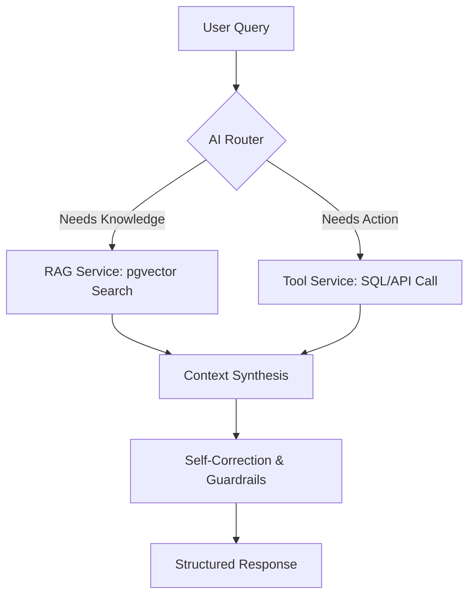

## AI Knowledge & Operations Agent (Agentic RAG)

**A production-ready intelligence layer for modern business automation.**

This project defines an **Agentic RAG system** that can:

- **Understand** your internal documents (PDFs, docs, chat logs, knowledge base).
- **Act** on your behalf via tools (inventory APIs, ticketing, CRM, calendar, etc.).
- **Correct itself** to reduce hallucinations and unsafe outputs.

The goal is to later implement this design using **NestJS**, so this README focuses on a clear, future-proof architecture and setup.

---

## Vision

Modern companies are drowning in unstructured data. Traditional search is keyword-based and often fails to capture **meaning**, intent, and context.

This system is not just a chatbot; it is an **Agentic AI Orchestrator** that:

- **Reasons over private documentation** using RAG.
- **Calls internal tools and services** (SQL, HTTP APIs, 3rd-party SaaS).
- **Uses guardrails and self-correction** to improve reliability.

---

## Core Architecture

The system follows the **Reason–Act (ReAct)** pattern:

- The LLM does not just answer directly.
- It **plans**, **decides which tools to call**, **executes actions**, then **produces a final, structured response**.

### 1. Advanced RAG Pipeline

- **Vector Engine**: PostgreSQL with `pgvector` for semantic search.
- **Smart Chunking**: ~1000-token recursive splitting with overlap for coherent context.
- **Hybrid Search**:
  - Vector similarity for semantic matching.
  - SQL metadata filters for precision (e.g. document type, owner, tags, timestamps).

### 2. Agentic Tool System

The agent can call tools to interact with your business data and operations, for example:

- **`check_inventory()`**: Fetch live stock levels from SQL or internal APIs.
- **`create_support_ticket()`**: Open a Jira or database ticket from a user issue.
- **`book_product_demo()`**: Schedule product demos in a calendar system.

In NestJS, each of these tools will typically map to:

- A **service class** (e.g. `InventoryService`, `TicketsService`).
- An **agent tools layer** that exposes safe wrappers to the LLM.

---

## Tech Stack (Planned)

- **Backend Framework**: NestJS (Node.js enterprise framework).
- **AI Orchestration**: `LangChain.js` and `LangGraph`.
- **LLM Provider**: Google Gemini 1.5 (Flash / Pro).
- **Database**: PostgreSQL with `pgvector` extension.
- **ORM**: Prisma or TypeORM (to be finalized).
- **API Documentation**: Swagger / OpenAPI.

---

## High-Level Data Flow

Conceptual flow of a user query through the system:



- **AI Router**: Decides whether to use RAG, tools, or both.
- **RAG Service**: Retrieves relevant context from the vector store.
- **Tool Service**: Executes business actions (inventory, tickets, CRM).
- **Self-Correction & Guardrails**: Validates and adjusts responses.
- **Structured Response**: Returns a safe, useful answer to the caller.

---

## Business Value

- **Reduce Support Costs**: Deflect a large portion of repetitive tickets by answering from documentation and tools.
- **24/7 Sales Support**: Recommend products based on **user intent**, not just keywords.
- **Faster Onboarding**: New employees can query handbooks, SOPs, and policies in natural language.

---

## Getting Started (Planned Setup)

> The exact commands may change as the NestJS project is implemented, but this is the intended baseline flow.

### 1. Prerequisites

- **Node.js** `v18+`
- **PostgreSQL** with the **`pgvector`** extension enabled
- **Google Gemini API key**

### 2. Installation

Once the NestJS project is created, a typical setup will look like:

```bash
npm install
cp .env.example .env
npx prisma migrate dev   # or TypeORM migrations
npm run start:dev
```

### 3. Environment Variables (Example)

The actual variables will be defined when the NestJS app is scaffolded, but will likely include:

- `DATABASE_URL`
- `GEMINI_API_KEY`
- `VECTOR_COLLECTION_NAME`
- `PORT`

---

## API Usage (Concept)

Example of how a client might interact with the agent once the NestJS APIs exist:

```http
POST /agent/chat
Content-Type: application/json

{
  "message": "I need a warm jacket for a ski trip, what's in stock?"
}
```

Expected behavior:

- The agent searches the vector DB for relevant product and domain knowledge (e.g. "warm jacket", "ski", "weather", etc.).
- It calls the **`check_inventory`** tool to verify real-time stock and sizes.
- It returns a **structured, natural-language response** with product recommendations and availability.

---

## Roadmap

Planned next steps for turning this design into a full NestJS project:

1. **Initialize NestJS project** with a modular architecture (`AgentModule`, `RagModule`, `ToolsModule`, etc.).
2. **Integrate database layer** with PostgreSQL and `pgvector` (Prisma or TypeORM).
3. **Implement RAG service** for ingestion, chunking, and retrieval.
4. **Implement tools layer** (inventory, tickets, calendar) with proper authentication and error handling.
5. **Wire up LangChain / LangGraph flows** to orchestrate ReAct-style reasoning and tool calls.
6. **Expose HTTP APIs** (e.g. `/agent/chat`) with Swagger documentation.
7. **Add monitoring, logging, and basic analytics** for queries and tool usage.

This README is organized to guide that implementation step by step once you are ready to build the NestJS project.

🚀 AI Knowledge & Operations Agent (Agentic RAG)
A Production-Ready Intelligence Layer for Modern Business Automation.

🎯 The Vision
Modern companies are drowning in unstructured data (PDFs, docs, chat logs). Traditional search fails because it looks for words, not meaning. This system isn't just a chatbot—it's an Agentic AI that can:

Reason over your private documentation (RAG).

Act on your behalf by calling internal APIs (Inventory, Tickets, CRM).

Correct itself to prevent hallucinations.

🧠 Core Architecture
This project implements the "Reason-Act" (ReAct) pattern. Instead of a linear flow, the AI acts as an Orchestrator.

1. Advanced RAG Pipeline
Vector Engine: Powered by pgvector for high-performance semantic retrieval.

Smart Chunking: 1000-token recursive splitting with overlap to maintain context.

Hybrid Search: Combines vector similarity with SQL metadata filtering for pin-point accuracy.

2. Agentic Tool System
The Agent doesn't just talk; it uses Tools to bridge the gap between AI and your Business Data:

check_inventory(): Fetches live stock levels from SQL.

create_support_ticket(): Automatically generates a Jira/Database ticket from a user issue.

book_product_demo(): Schedules entries into the company calendar.

🏗️ Tech Stack
Core: NestJS (Node.js Enterprise Framework)

AI Orchestration: LangChain.js & LangGraph

Intelligence: Google Gemini 1.5 Flash / Pro

Database: PostgreSQL with pgvector extension

ORM: Prisma / TypeORM

Documentation: Swagger / OpenAPI

🔁 Data Flow
Code snippet

graph TD
    A[User Query] --> B{AI Router}
    B -- Needs Knowledge --> C[RAG Service: pgvector Search]
    B -- Needs Action --> D[Tool Service: SQL/API Call]
    C --> E[Context Synthesis]
    D --> E
    E --> F[Self-Correction/Guardrails]
    F --> G[Structured Response]
📈 Business Value
Reduce Support Costs: Deflect up to 60% of repetitive tickets.

24/7 Sales Support: Instantly recommend products based on user intent, not just keywords.

Zero-Entry Onboarding: Allow new employees/customers to query your entire handbook instantly.

🛠️ Getting Started
1. Prerequisites
Node.js v18+

PostgreSQL with pgvector enabled

Google Gemini API Key

2. Installation
Bash

npm install
cp .env.example .env
npx prisma migrate dev
npm run start:dev
3. API Usage
Ask the Agent:

Bash

POST /agent/chat
{
  "message": "I need a warm jacket for a ski trip, what's in stock?"
}
The agent will search the vector DB for 'warm jacket', then use the checkStock tool to verify availability before answering.